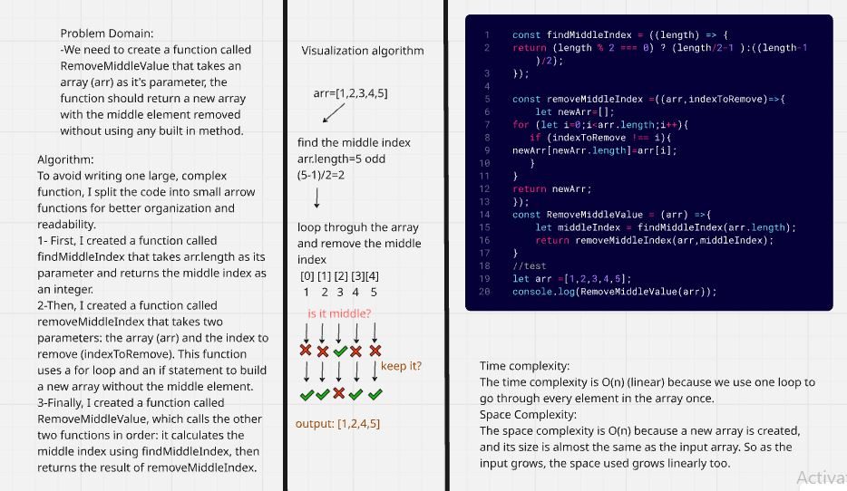
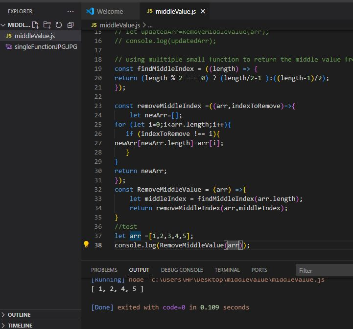

## Challenge 04: Remove Middle Index

### The goal of this challenge is to create a function that removes the middle element from an array without using any built-in JavaScript methods.

### Image of WhiteBoared:

### Image of console.log Output:
