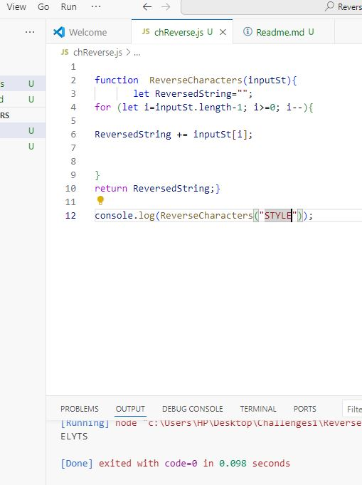

# Challenge 03: **Reverse Characters**

## The ReversedCharacters function takes a single string as input and returns a new string with all the characters reversed.without using any built in methods.

### Image of solution

### Image of console.log output

