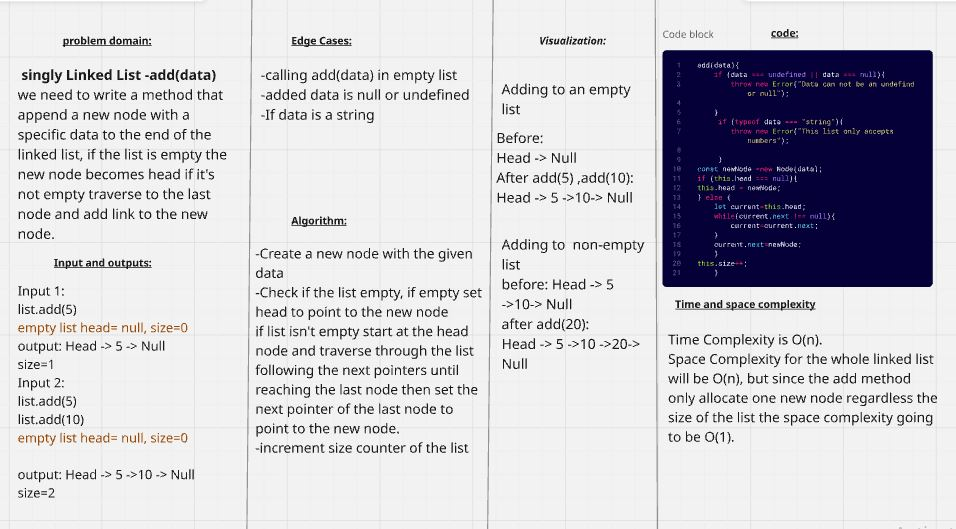
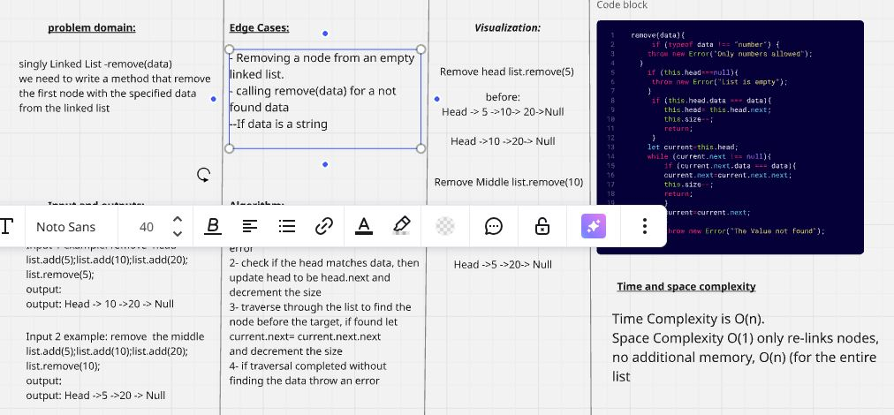
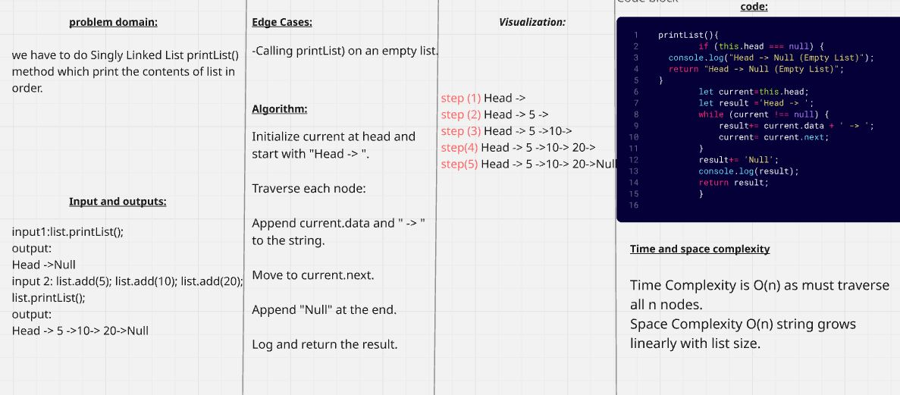
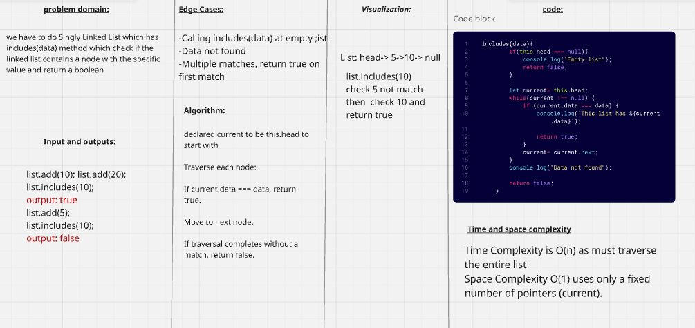
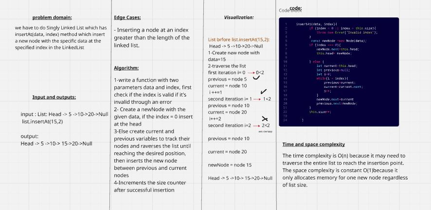
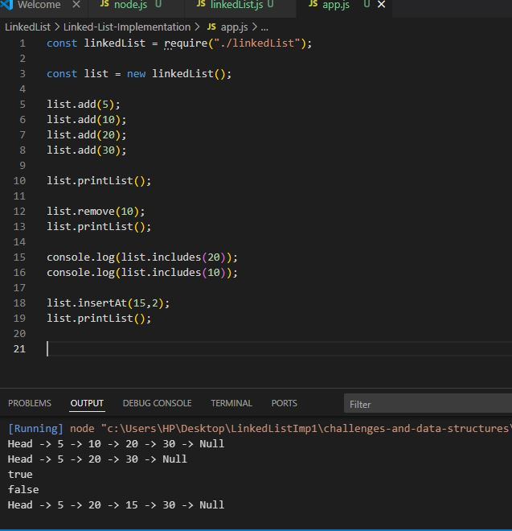
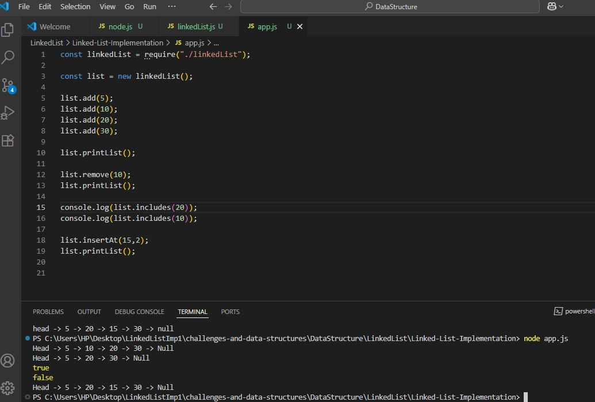

## whiteBoard captures for each method to create a singly linkedlist Data structture.

### Add(data)

### Remove(data)

### printList()

### includes(data)

### insertAt(data,index)

### Screenshot of the console output:

