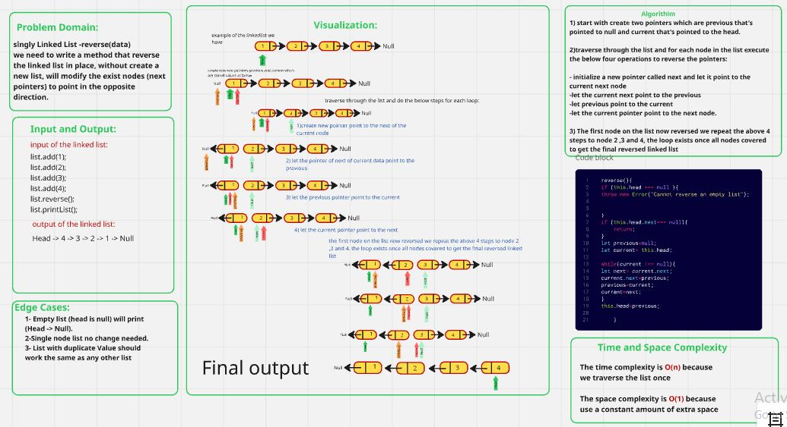
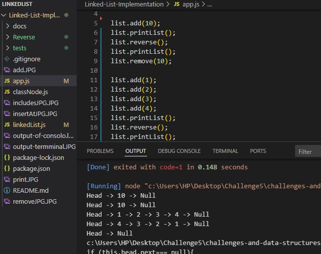
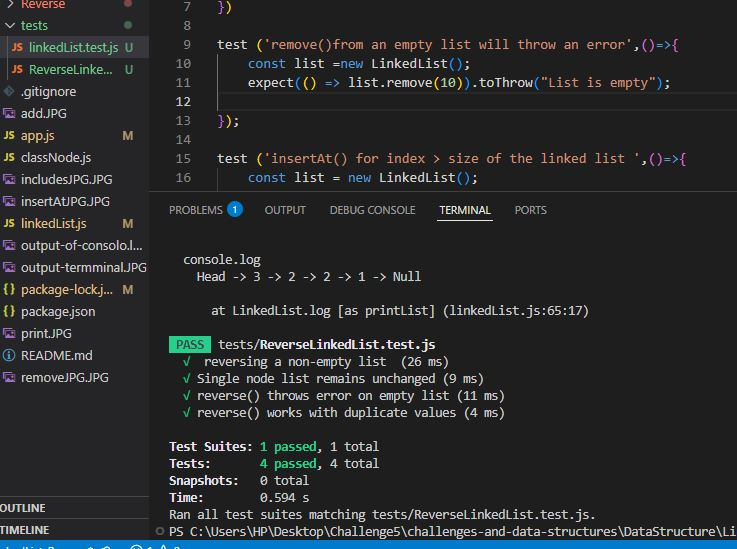

# Reverses the linked list in place.
### Reverses the singly linked list in place by modifying the existing nodes' next pointers to point in the opposite direction.
### This method does not create a new list or allocate additional memory for node storage.
### It handles edge cases such as an empty list, a single-node list gracefully or List with dublicate values.

## Capture of the whiteBoared

## Capture of the console-log Output

## Capture of the test terminal 

    