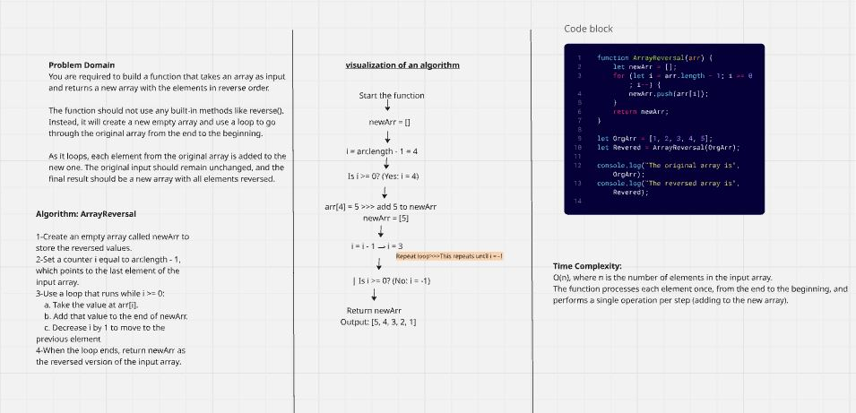
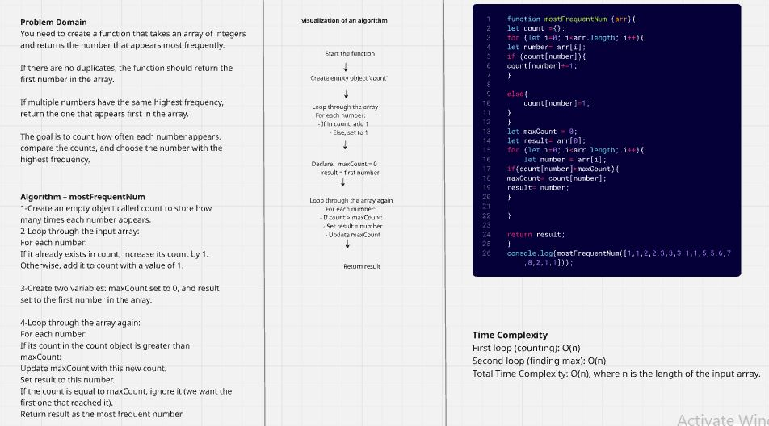
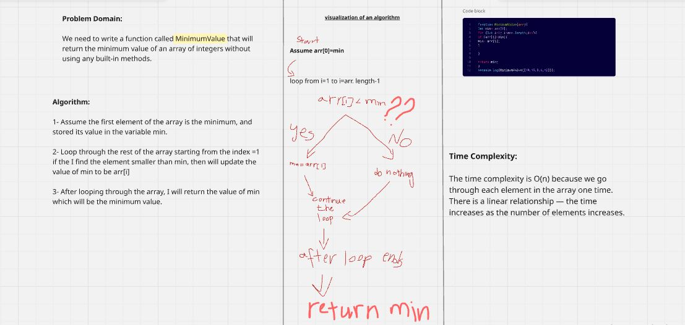

# Challenge A: Array Reversal

## Description:
### In this challenge, our task is to write a function named ArrayReversal that takes an array as input and returns a new array with the elements in reverse order. we must not use any built-in methods and reverse the elements of an array manually and return the result.

 
# Challenge B: Most Frequent Number 

## Description:

### Write a function that takes an array of integers and returns the number that appears most frequently.

### If there are no duplicates, return the first number in the array.

### If multiple numbers have the same highest frequency, return the first one encountered among them in the array.

# Challenge C: MinimumValue Challenge

## Description:

### The challenge is to create a function named MinimumValue that takes an array of integers and returns the smallest number, without using any built-in methods.

<<<<<<< HEAD
# Challenge 03 Reverese Characters:

[Reverese Characters README.md ](README.md)
=======

# Challenge 03: Reverse characters

Click below
[Reverse characters README](README.md)
>>>>>>> origin/main
